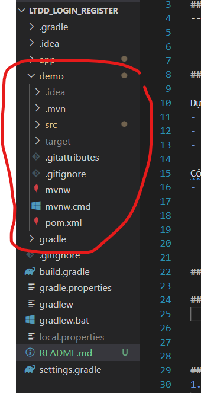

# Hướng dẫn sử dụng dự án

## Thành viên tham gia
- **Phạm Tiến Anh - 22110282**
- **Nguyễn Đức Sang - 22110404**

---

## 1. Mô tả dự án

Dự án cung cấp các chức năng:
- **Đăng ký tài khoản**: Gửi OTP qua email để kích hoạt tài khoản.
- **Đăng nhập**: Sử dụng email và mật khẩu.
- **Quên mật khẩu**: Gửi OTP qua email để đặt lại mật khẩu.

Công nghệ sử dụng:
- **Android (Java)**: Giao diện người dùng, sử dụng thư viện **Retrofit** để gọi API.
- **Spring Boot**: Xây dựng API backend.
- **MySQL**: Quản lý cơ sở dữ liệu.

---

## 2. Triển khai ứng dụng

### a. Cấu hình Backend
1. Sử dụng **Spring Boot** và **MySQL** để triển khai backend.
2. Hình ảnh minh họa:
   - **Spring Boot**:
     
   - **MySQL**:
     
3. Mã nguồn backend được lưu trong folder `demo`:
   

---

### b. Cấu hình Android
1. Thêm thư viện Retrofit vào file `build.gradle`:
   ```groovy
   implementation libs.gson
   implementation libs.retrofit
   implementation libs.converter.gson
   ```
2. Cấu hình file `AccountAPI.java`:
   ```java
   public interface AccountAPI {
       @POST("/account/login")
       Call<AccountDTO> login(@Body AccountDTO accountDTO);

       @POST("/account/register")
       Call<MessageDTO> register(@Body RegisterDTO registerDTO);

       @POST("/account/check-user")
       Call<MessageDTO> checkUser(@Body String email);

       @FormUrlEncoded
       @POST("/account/send-otp-for-register")
       Call<MessageDTO> sendOtpForRegister(@Field("email") String email);

       @FormUrlEncoded
       @POST("/account/send-otp")
       Call<Void> sendOtp(@Field("email") String email);

       @POST("/account/verify-otp")
       Call<Void> verifyOtp(@Query("email") String email, @Query("otp") String otp);

       @FormUrlEncoded
       @POST("/account/reset-pass")
       Call<Void> resetPass(@Field("email") String email, @Field("password") String password);
   }
   ```
3. Cấu hình file `RetrofitClient.java`:
   ```java
   public class RetrofitClient {

       private static Retrofit retrofit;
       private static final String BASE_URL = "http://10.0.2.2:8080"; // Thay thế với URL của Spring Boot API

       public static Retrofit getRetrofitInstance() {
           if (retrofit == null) {
               retrofit = new Retrofit.Builder()
                       .baseUrl(BASE_URL)
                       .addConverterFactory(GsonConverterFactory.create()) // Chuyển đổi JSON sang đối tượng
                       .build();
           }
           return retrofit;
       }
   }
   ```
4. Sử dụng Retrofit để gọi API từ giao diện người dùng.

---

## 3. Tính năng demo
- **Đăng ký tài khoản**:
  - Nhập email và mật khẩu.
  -  

  - Gửi OTP đến email, sau đó xác thực để kích hoạt tài khoản.
  - 
  - 


- **Đăng nhập**:
  - Sử dụng email và mật khẩu đã đăng ký để đăng nhập.
  - 
  - Đăng nhập thành công :
  - 


- **Quên mật khẩu**:
  - Nhập email, nhận OTP qua email, sau đó đặt lại mật khẩu mới.
  - 
  - 
  - 
  - 


   
---


